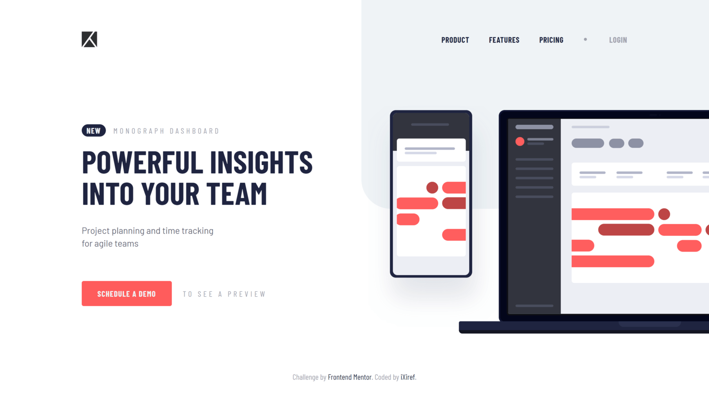

## Live

[Live](https://felixcriollo.github.io/2.14-Project-tracking-intro-component/public/)

## The Challenge
Your users should be able to:

- View the optimal layout for the site depending on their device's screen size
- See hover states for all interactive elements on the page

## Built With
- CSS custom propertys
- PostCss [
  - postcss-cli
  - postcss-import
  - postcss-preset-env
  - postcss-focus
  - autoprefixer 
]
- Vanilla JS

## What I Practice
I practiced more my manage with postcss, search some plugins and add ones. Also practiced my semantic structure html, and practice my file structure in the challenge for was more readable.

Any advice for improve is welcome 💙

# Frontend Mentor 